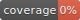

# @imperium/graphql-client

## Environment Variables
These can be specified in a `.env` file in the client package. These are also not secret as they are included in the client build and available on the client.

|Variable|Default|Description|
|---|---|---|
|SERVER_PROTOCOL|'http'|What protocol the server is accessible at.|
|SERVER_HOST|'localhost'|What host the server is accessible at.|
|SERVER_PORT|4001|What port the server is accessible at.|
|GRAPHQL_URL|'/api/graphql'|What endpoint the graphql server is accessible at.|
|GRAPHQL_WS|false|Enable graphql subscriptions via a websocket.|
