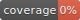

# @imperium/graphql-server

## Environment Variables

These can be specified in a `.env` file in the server package. These variables are secret and not shared with the client.

| Variable                         | Default        | Description                                   |
|----------------------------------|----------------|-----------------------------------------------|
| IMP_GRAPHQL_URL                  | '/api/graphql' | What the graphql endpoint URL is.             |
| IMP_GRAPHQL_ENABLE_SUBSCRIPTIONS | false          | Enable graphql subscriptions via a websocket. |
| IMP_GRAPHQL_BODY_LIMIT           | '1mb'          | The size allowed in a graphql body.           |
